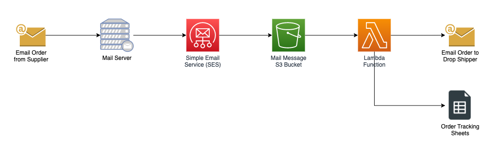

I was currently revisiting a process automation I had implemented several years ago and figured I would review and document it to show what an example of common and real-world automation looks like. One reason to show this is I frequently see articles on "5 Python Automation You Need Now To Save Millions" ___[Insert Sarcasm]___ but often only include a few lines of code and skips over some important parts needed to implement a real-world process in my view. This being said there are several methods and approaches to automating processes all depending on needs and skill levels.  

## Setting the Stage 
I have some products listed and sold on an online retailer, that are fulfilled by a local manufacturer in a drop-ship fashion. When an order is placed on the retailer's website they send an email to me for fulfillment and in turn, I need to send a request to the manufacturer to ship the order to the end customer.  

A few consideration in the process is that not all orders from the retailer go to the local manufacturer, also only a subset of the information provided by the retailer in the email needs to be sent to the manufacturer. Additionally, a Google Sheet needs to be updated that is used to track the orders.   

Outlined below is the flow that was used to automate the process using AWS Simple Email Service, Lambda functions, and Python.  
 
 ### Flow
 1. An order arrives at a mailbox from the retailer 
 2. The mail server then forwards the order email to the AWS Simple Email Service (SES)
 3. SES receives the mail and delivers it to an S3 bucket
  
  

 4. The S3 bucket raises an event based on the object creation that kicks off the Lambda 
 5. The Lambda function ingests the mail object from S3 and does some validation 
 6. If a valid mail object (expected message type, and sender) then it processes the message
 7. A new email is created based on the original mail content and sent to the manufacturer via the mail server
 8. Update a Google Sheet that is used to track the orders  
   
## Email Accounts and Forwards 
The email setup for handling the inbound orders includes a dedicated email account created to receive the orders from the retailer and a forward rule to submit the email order messages to the relay domain `ses.mydomain.net` setup below. 

The setup for the outbound orders to the manufacturer uses an existing mail account that is used to send out orders. 

## Simple Email Service (SES) 
The AWS SES setup was a little tricky when it was originally done, but the gist of it was as follows: 
1. I set up an additional mail subdomain `ses.mydomain.net` in my mail and DNS servers that can be used to forward the email setup above too. 
2. Setup a `Verified Identity` for the email subdomain above in SES
3. In SES create an `Email receiving` ruleset that handles the inbound forwarded e-mails and writes them to the S3 bucket. I use two rules based on the email address for delivery to testing or production S3 bucket. 

## S3 Buckets and Events
The S3 setup is really simple in this case I just have a trigger on the `All object create events` to start the lambda up. Security wise it is a private bucket with a policy to allow the SES service to write to it.
 
Two buckets are set up and delivered one for testing and another for production, the above SES rules with create the mail in the respective one and they will trigger different lamdas. 

## AWS Lambada Function
To simplify the actual Lambda implementation I developed a standalone Python module that handles the ingestion and parsing of the inbound HTML-based e-mail message with BeautifullSoup, normalizes the extracted to a data object and then renders an HTML message using Jinja2 templates. This leaves the Lambada with the role of setting up the data needed and orchestrating the process. 

Tree topping below on how the custom module and the Lambda function are put together. 

### Code Excerpts 
This is the core of the Lambda handler, it reads the record out of the S3 event and then fetches the reference object from the S3 bucket. Once we have the object we pass it into the inbound email parser which returns an instance of the modules and we can then generate an outbound email body. Now we use the `send_email` function to send the email out to the supplier and update the Google sheet. 

```python 
## Import custom processor module
from ud_epr_in import EmailParserRendererIn
import boto3

for record in event["Records"]:
  s3resource = boto3.resource("s3")
  bucket = record["s3"]["bucket"]["name"]
  key = record["s3"]["object"]["key"]

  obj = s3resource.Object(bucket, key)
  body = obj.get()["Body"].read()

  epr = EmailParserRendererIn(body, "wayfair")
  epr.parse_email()
  email = epr.render_email()
  send_email(epr.supplier_id, epr.purchase_order_number, email)

  if epr.supplier_id == "12" and epr.status == Status.NEW:
      gs_items = get_google_sheet_items(epr)
      google_sheet_update(gs_items)
```

The `send_email` function has been simplified since it supports sending to multiple recipients based on the product id. The core is straightforward using the standard Python email and smtplib libraries, and just setups the needed email message values including the body which was generated above in the custom module. The email is then sent via my mail server via a TLS SMTP connection. 

```python
def send_email(product_id, po_number, order_html):

    ## Setup for determining from, to, subject, etc omitted 
    email_message = EmailMessage(policy=policy.SMTP)
    email_message.add_header("To", to_email)
    email_message.add_header("From", from_email)
    email_message.add_header("Subject", subject)
    email_message.add_header("Date", format_datetime(datetime.now()))
    email_message.set_content(order_html, disposition="inline", subtype="html", cte="quoted-printable")
    email_message.make_mixed()

    context = ssl.create_default_context()
    smtp_server = SMTP(SMTP_HOST, SMTP_PORT)
    smtp_server.starttls(context=context)
    smtp_server.login(SMTP_USER, SMTP_PASS)
    smtp_server.sendmail(from_email, to_email, email_message.as_bytes())
    smtp_server.quit()
```

Updating the Google Sheet is also straightforward - once you get the Google side setup sorted out. The first thing that needs to be done is to create rows to insert from order data, it is possible to have multiple line items per order. Once we have a set of rows we pass that into the actual function that handles inserting them into the Google Sheet. This is simple enough as we are only appending to the existing worksheet.

```python
def get_google_sheet_items(epr):
    gs_items = []
    gs_items = [
        [
            item.quantity,
            f"{item.product_id} - {item.description}",
            "",
            date.today().strftime("%d-%m-%Y"),
            "Wayfair",
            epr.wpo.shipping_company,
            epr.wpo.must_ship_by_date,
            epr.wpo.purchase_order_number,
        ]
        for item in epr.wpo.items
    ]
    return gs_items

def google_sheet_update(gs_items):
    try:
        sheets = gc.open_by_key(GSHEET_ID)
        worksheet = sheets[0]
        for item in gs_items:
            worksheet.append_table(values=item)
```

### Secrets and Environment-Specific Configurations
To make the design somewhat secure and flexible enough to have development and production deployments I used AWS System Manager Parameter Store. I used Serverless Framework to build the function and here is a snippet of the config that shows how for each deployment environment we set the environment variable in the lambda to point to the environment-specific parameter. 

```yaml
  myStage: ${opt:stage, self:provider.stage} # Set the default stage used. Default is dev
  smtp_prefix: /ud_email_orders/
  smtp_host:
    dev: /ud_email_orders/SMTP_HOST_DEV
    prod: /ud_email_orders/SMTP_HOST_PROD
```

Then in the handler, fetch the environment variable that had been defined in the Lambda function as a local variable.

```python
ssm = boto3.client("ssm")
SMTP_HOST = ssm.get_parameter(Name=os.environ["SMTP_HOST"], WithDecryption=False)["Parameter"]["Value"]
SMTP_PORT = ssm.get_parameter(Name=os.environ["SMTP_PORT"], WithDecryption=False)["Parameter"]["Value"]
SMTP_USER = ssm.get_parameter(Name=os.environ["SMTP_USER"], WithDecryption=False)["Parameter"]["Value"]
SMTP_PASS = ssm.get_parameter(Name=os.environ["SMTP_PASS"], WithDecryption=True)["Parameter"]["Value"]

GSHEET_ID = ssm.get_parameter(Name=os.environ["SW_GSHEET_ID"], WithDecryption=False)["Parameter"]["Value"]
GSHEET_AUTH = json.loads(ssm.get_parameter(Name=os.environ["GSHEET_AUTH"], WithDecryption=True)["Parameter"]["Value"])
```

## Wrap-up 
There are a lot of things I did not cover, like the using GIT repo, the CICD pipeline setup in AWS, how testing is done, using the Serverless framework, or how painful or brittle it is to scrape HTML in an email. Honestly, I put this into play over 3 years ago and just runs, I had to build error handling to let me know when the process has issues and it is always around changes in the email format. 

Cost wise this whole process runs well within the free tier for everything, and skill wise was something I could handle, and I would think for a technical resource with a little cloud exposure and some programming skills this is a medium-low on the Janka scale. 

At the time this was created the retailer Wayfair only supported email or EDI, but now supports restful API and the plan is to re-write the automation and include updating the Quickbooks with the orders as well. 