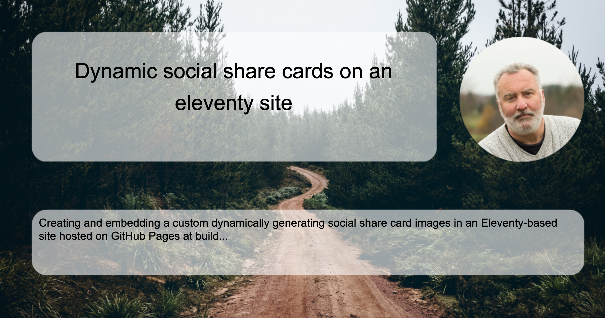

As I was going through setting up the new site I needed to sort out the default Eleventy Duo themes social share card. As I was looking into this I decided I really wanted to have cards that are customized per page on the off chance someone wants to share my thoughts. An example below is what I am referring to as a dynamic card, where the card is generated per page/post and contains specifics such as the title and description. I did decide on a default static card for the main site.  



## Tools and Options
I did some digging in google and found several posts and plugins for 11ty on approaches to create social share images, and came up with a couple of considerations. First, this site is hosted on GitHub Pages and built with GitHub actions so any approach that would not easily support that was out. Secondly, some of the tools used external sites such as Cloudinary as part of the process and I was not interested in this.  

I decdied on the [eleventy-plugin-social-img](https://github.com/tannerdolby/eleventy-plugin-social-img) plugin as it seemed to generally tick the boxes. I added it to the site and started to play with it.  I will say the documentation is not as clear as I would expect and I had a couple of issues I should reach out to the maintainer about, they slowed me down more than actually being a blocker. The real issues I had were not with the plugin so much as my understanding of template chaining, template scopes and how/where to inject the code so I can have access to the generated URL for the images to include in the page OG metadata. I figured it out and is covered below. 

## Process and Approach 
Once I decided what tool I was going to use I started by using one of the default themes provided by the plugin to figure out how it worked, what it generated and how to include it in the site. As I suspect is the expectation I did not like the default themes, so I moved on to the next step of creating a custom card. 

To figure out what I wanted as a card design I created a [sample page](/social-share.html) just as a template without using the plugin. This allowed me to play and iterate with the design and layout of what I wanted to create for the card.  After playing around I decided on creating a background template with a background (looks like a great road to race on), a photo of myself, and some text areas in Canva. Then using the chrome dev tools to sort exactly the style elements and placements that were needed. 

## Custom Dynamic Social Share Cards 
I took the design I came up with above and then rolled it into a template using the `eleventy-plugin-social-img` shortcode plugin. The template takes the post title and description and uses that to render the social card and then returns the URL to the generated image. 


``` liquid


{{ title | slug }}
 
<style>
    body { background-image: url('http://localhost:8080/images/social-share-post-card.png');background-repeat: no-repeat; background-attachment: fixed; background-size: 1200px 630px; font-family: IBM Plex Sans,sans-serif; }
    .title { position: absolute; top: 62px; left: 62px; width: 793px; height: 247px; padding: 5px; font-size: 42; text-align: center; }
    .title p { line-height: 1.5; display: inline-block; vertical-align: middle; }
    .description { position: absolute; top: 415px; left: 63px; width: 1066px; height: 101px; padding: 14px; font-size: 22; }
</style>
<div class="container">
  <div class="title"><p>{{ title }}</p></div>
  <div class="description">{{ desc }}</div>
</div>



  

```
Now that I can create a dynamic social card image and URL to it, let's figure out how to call it and use it!

## Social Share Card Generation
Now the social card template needs to be integrated into the base template page so that we can influence the OG metadata. Firstly we want to control if we are generating a social card by including Front Matter attribute `socialcard: true` in the target pages. Another issue is in the templating chaining the URL variable `socialCardUrl` was set and local to scoped block when using `include`. Using the `import` with the variable name returns the URL to be used on the main page. 

``` liquid 

    
    
        
    



    


    <meta property="og:image" content="{{ socialImage | url | absoluteUrl(site.url) }}"/>
    <meta property="og:image:alt" content="{{ desc }}">
    <meta name="twitter:image" content="{{ socialImage | url | absoluteUrl(site.url) }}"/>
    <meta name="twitter:image" content="{{ desc }}">"


```
The block is included in the main page template and will only generate a dynamic social card if the frontmatter is set. The returned URL will then set the `socialImage` variable that is used in setting the page Open Graph metadata.  

### URL and deploy fixes 
An issue I noticed with the production build was the generated URL was `http://localhost:8080/social-share/...` instead of `https://kemikal.io/`. Digging into the documentation I noticed a comment about the URL on Netlify using the `process.env.URL` environment variable. I did not pay too much attention to this comment as the site was deployed to GitHub pages, but after looking into the code I found:

``` javascript
    // Netlify provides an environment variable `env.URL` at build time
    // this is the URL of the deployed site on Netlify - credit @5t3ph
    const siteUrl = process.env.URL || "http://localhost:8080";
```
This explains the issue since the `URL` environment variable is not set locally or in the GitHub build. This should be an easy enough fix, by setting the variable when starting the `URL="https://kemikal.io" yarn dev` kinda worked but with a strange side effect that the generated URL was `https://kemikal.io/kemikal.io/social-share/...`. If the variable is just set to `URL="https://" yarn dev` then the URL's are set correctly. 

To resolve the issue in the production build on GitHub an environment variable was added to the GitHub workflow. 

``` diff-yaml

      - run: yarn install
      - run: yarn build
+        env:
+          URL: https://          
      - name: Upload artifact
```
## Note 
Something to mention is that when testing this on actual social media sites they cache the card images that are displayed. I had this with a test post on Twitter but after some digging around I found that it will use the proper image in the actual post. 

## Wrap Up 
So with this all pulled together I now have custom social cards being dynamically generated by post based on frontmatter and built as part of the build process. Test this out by clicking on one of the links below to share it. 

If happens to not work please let me know...