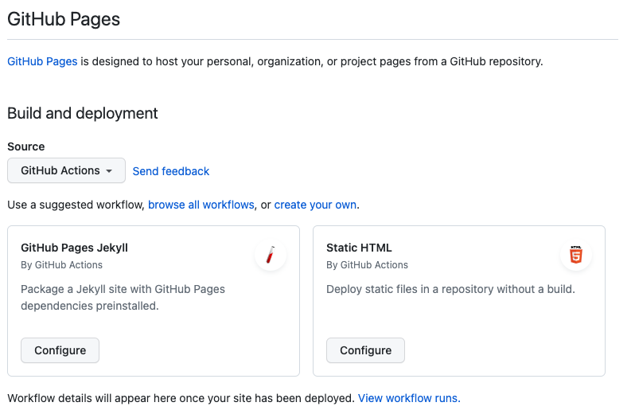

It seems fitting that the first post for my new blog is documenting setting up a new Eleventy site and using the new beta Github Actions for Pages deployment. The workflow action code below is based on the sample GitHub Pages Jekyll workflow that is provided. 

## GitHub Pages Setup

In order to enable publishing to GitHub pages via actions, go to the Pages section under settings and change the default from `Deploy from a branch` to `GitHub Actions` (this is currently a Beta function). 



The workflow below was based on the standard Jekyll workflow provided with some simple changes that are detailed below. 

> It does not appear that the .nojekyll or CNAME files are required to be maintained when using the new GitHub Actions for a site deployment.  

### Workflow Setup 

A trigger needs to be set up that is used to kick off the workflow to start the build and deployment to the GitHub page. In this case, the trigger is based on a push to the master branch for the Eleventy website.  
  
```yaml 
on:
  # Runs on pushes targeting the default branch
  push:
    branches: ["master"]
```

Setting permissions of `GITHUB_TOKEN` to allow some of the actions that need to access the token.

```yaml
# Sets permissions of the GITHUB_TOKEN to allow deployment to GitHub Pages
permissions:
  contents: read
  pages: write
  id-token: write
```

As a bit of a sanity check, the job concurrency is set for the pages group to allow it to cancel any in-progress builds if build jobs are triggered multiple times.  
```yaml
# Allow one concurrent deployment
concurrency:
  group: "pages"
  cancel-in-progress: true
```

### The Build 

Two jobs are defined in the workflow, one that takes care of building the static site and another that will deploy the build artifacts to GitHub pages. 

```yaml
jobs:
  # Build job
  build:
    runs-on: ubuntu-latest
    strategy:
      matrix:
        node-version: [16.x]
    steps:
    ...
  deploy:
    environment:
      name: github-pages
      url:  ${{ steps.deployment.outputs.page_url }} 
    ...
```

Similar to the existing method of deploying via a specific branch, a few steps are required to build the site from a check-in. The first step is to check out the branch that triggered the workflow. 
```yaml
      - name: Checkout
        uses: actions/checkout@v3
```

The next step in the workflow configures the GitHub pages site and pulls some metadata that is used later in the deployment using a provided action. 
```yaml
      - name: Setup Pages
        uses: actions/configure-pages@v3
```

Once the basic setup is done this step is used to build the Eleventy static site and this is where the real change from the Jekyll action takes place. The process here is similar to other builds for Eleventy with GitHub actions to publish from a branch, set up Node, install package dependencies and then build the site. 
```yaml

      - name: Build with Node.js ${{ matrix.node-version }}
        uses: actions/setup-node@v1
        with:
          node-version: ${{ matrix.node-version }}
      - run: npm install -g yarn
      - run: yarn install
      - run: yarn build    
```

After the build of the site has been completed then the output directory (/public in this case) is then processed and packaged into an archive artifact that is then uploaded to be deployed in the next phase. 
```yaml
      - name: Upload artifact
        uses: actions/upload-pages-artifact@v1
        with:
          path: ./public
```

### The Deployment 

The deployment job uses the newer `deploy-pages` action (currently still in Beta) to take the artifact produced in the last step and deploy it directly to our site hosted on GitHub pages. 
```yaml
  deploy:
    environment:
      name: github-pages
      url:  ${{ steps.deployment.outputs.page_url }} 
    runs-on: ubuntu-latest
    needs: build
    steps:
      - name: Deploy to GitHub Pages
        id: deployment
        uses: actions/deploy-pages@v1
```

### Full GitHub Action Workflow

```yaml
---
# Workflow for building and deploying an Eleventy static site to GitHub Pages via an Action
name: Deploy Eleventy with GitHub Pages dependencies preinstalled

on:
  # Runs on pushes targeting the default branch
  push:
    branches: ["master"]

  # Allows you to run this workflow manually from the Actions tab
  workflow_dispatch:

# Sets permissions of the GITHUB_TOKEN to allow deployment to GitHub Pages
permissions:
  contents: read
  pages: write
  id-token: write

# Allow one concurrent deployment
concurrency:
  group: "pages"
  cancel-in-progress: true

jobs:
  # Build job
  build:
    runs-on: ubuntu-latest
    strategy:
      matrix:
        node-version: [16.x]
    steps:
      - name: Checkout
        uses: actions/checkout@v3
      - name: Setup Pages
        uses: actions/configure-pages@v3
      - name: Build with Node.js  ${{ matrix.node-version }} 
        uses: actions/setup-node@v1
        with:
          node-version:  ${{ matrix.node-version }} 
      - run: npm install -g yarn
      - run: yarn install
      - run: yarn build          
      - name: Upload artifact
        uses: actions/upload-pages-artifact@v1
        with:
          path: ./public

  # Deployment job
  deploy:
    environment:
      name: github-pages
      url:  ${{ steps.deployment.outputs.page_url }} 
    runs-on: ubuntu-latest
    needs: build
    steps:
      - name: Deploy to GitHub Pages
        id: deployment
        uses: actions/deploy-pages@v1
---
```

## References

- [GitHub Action - Checkout](https://github.com/actions/checkout)
- [GitHub Action - Configure Pages](https://github.com/actions/configure-pages)
- [GitHub Action - Upload Page Artifact](https://github.com/actions/upload-pages-artifact)
- [GitHub Action - Deploy Page](https://github.com/actions/deploy-pages)

